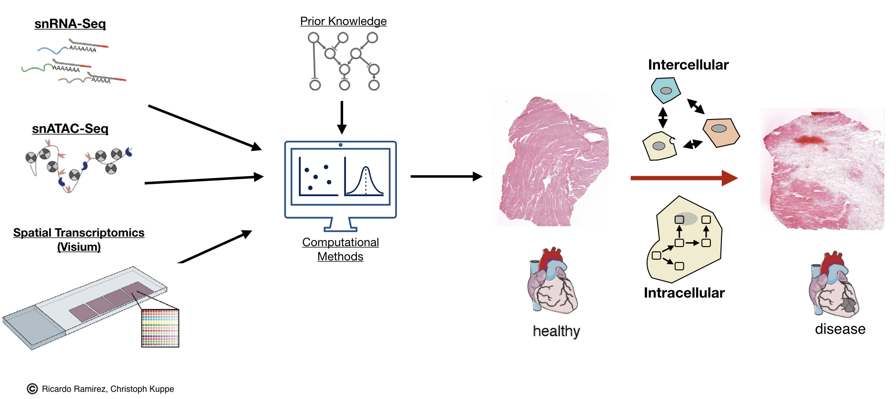

## Spatial multi-omic map of human myocardial infarction

Cardiovascular disease is the leading cause of mortality worldwide of which myocardial infarction is the largest contributor to the number of deaths. After myocardial infarction, inflammatory and reparative responses trigger widespread remodeling that affects the function of the heart. Understanding the intra- and intercellular signaling mechanisms within the heart that coordinate these tissue changes is a key step to develop novel therapeutics.  Here, we present an integrative map of human cardiac remodeling after myocardial infarction using single-cell gene expression, chromatin accessibility, and spatial transcriptomics profiling. Our study encompasses multiple physiological zones at distinct time points in myocardium from a total of 23 myocardial infarction and control patients, profiling over 250,000 cells and nearly 100,000 spatial transcriptomics locations. Multimodal data integration allowed us to characterize tissue structures of injury, repair, and remodeling that change in composition following ischemic injury. Moreover, we explored the relationships between the tissue reorganization and changes in the cardiac transcriptome and epigenome. We identified disease specific molecular states of cardiomyocytes, fibroblasts and myeloid cells that relate to specific spatial configurations of cells in the tissues. This integrative map represents an essential reference for the field that will allow the community to explore mechanistic hypotheses in animal models and compare disease molecular signatures of distinct cardiomyopathies.

 

In this repository it is possible to access to the code used in the analysis of single nuc RNA-seq, ATAC-seq and spatial transcriptomics (Visium) of the associated manuscript.

1) Integrative analyses of snRNAseq data and spatial transcriptomics are available [here](https://github.com/saezlab/visium_heart/tree/master/st_snRNAseq) 
2) Analysis of snATACseq data is available [here](https://github.com/saezlab/visium_heart/tree/master/snATAC_seq) 
3) Imaging analysis is available [here](https://github.com/saezlab/visium_heart/tree/master/smfish_analysis) 

### Availability of data

**cellxgene:**
Interactive views and availability of processed and annotated atlases (RNA and ATAC) are available via [cellxgene](https://cellxgene.cziscience.com/collections/8191c283-0816-424b-9b61-c3e1d6258a77)

**Human Cell Atlas:**
Aligned data of RNAseq/ATACseq/Visium after cellranger and spaceranger can be accessed through the [Human Cell Atlas Data Portal](https://data.humancellatlas.org/explore/projects/e9f36305-d857-44a3-93f0-df4e6007dc97). Note that for spatial transcriptomics, processed data of each slide is also provided as a Seurat R object with deconvolution results. SpaceRanger data of spatial transcriptomics contains a compressed *spatial* folder.\

**Zenodo:**
Mirrors of data present in the Human Cell Atlas Data Portal and cellxgene are available here: [Processed](https://zenodo.org/record/6578047#.YvETW-xBx-U), [Raw Part 1](https://zenodo.org/record/6578553#.YvETq-xBx-U), [Raw Part 2](https://zenodo.org/record/6578617#.YvETyuxBx-U), and [Raw Part 3](https://zenodo.org/record/6580069#.YvET1-xBx-U)

**Cell-states:**
R objects containing the cell-state descriptions in the manuscript can be downloaded from the following Zenodo link: https://zenodo.org/record/7098004#.Y0P_LC0RoeY

**Raw images**
Raw images of the analyzed slides can be found [here](https://zenodo.org/record/6778620#.Y0P_quzvB44)

**European Genome-Phenome Archive:**
EGA Accession number is [EGAS00001006330](https://ega-archive.org/studies/EGAS00001006330)

***

 ### How to cite
 > Kuppe C, Ramirez Flores RO, Li Z, et al. “Spatial multi-omic map of human myocardial infarction.” Nature. 2022. DOI: [10.1038/s41586-022-05060-x](https://www.nature.com/articles/s41586-022-05060-x)

To access the code of the **bioRxiv** please look at the following [tag](https://github.com/saezlab/visium_heart/releases/tag/biorxiv) \
To access the code of the **publication** please look at the following [tag](https://github.com/saezlab/visium_heart/releases/tag/publication)

