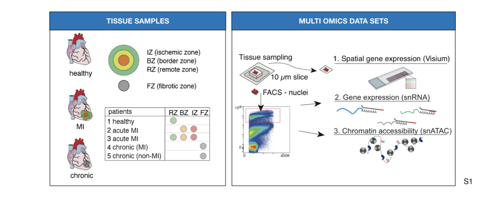
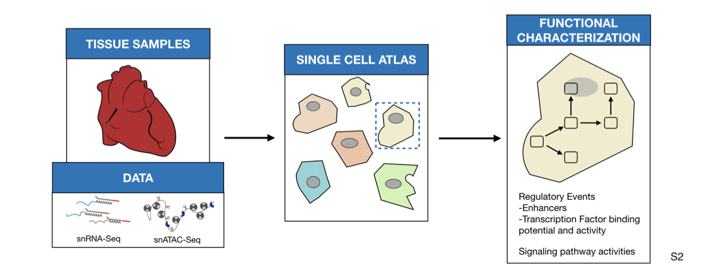
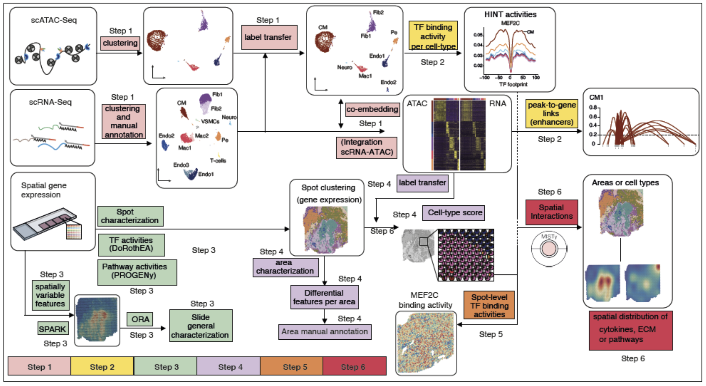

## Spatially integrated single cell transcriptomic and epigenomic map of human myocardial infarction

### Abstract

**Aims:** 

Cardiovascular diseases, including myocardial infarction (MI) are the leading cause of mortality worldwide. After MI, inflammatory and reparative responses trigger widespread myocardial remodeling that affects cardiac function. Understanding the heart specific intra- and intercellular signaling mechanisms that coordinate this remodeling is key to developing novel therapeutics. Here we present a multi-omics analysis of single cells and spatial transcriptomics to map human myocardial tissue in homeostasis and at different stages after MI. Eight left-ventricle samples of four MI patients and one healthy donor were profiled with 10x Visium spatial transcriptomics, single nuclear RNA-seq and single nuclear ATAC-seq.

 

**Methods and Results:** 
We performed an integrative analysis of single cell sequencing datasets to define a catalog of cell types that comprise the adult heart. We mapped cell lineages in space and estimated pathway and transcription factor activities to increase the resolution of the spatial datasets. Finally, we studied how tissue structure influenced the location of cell sub-types and their gene expression using MISTy, a machine-learning framework that models spatial interactions. We showed that the spatial distribution of cell types is explained by the local pathway activities, and nearby expression of cytokines and extracellular matrix proteins. We also observed that different combinations of cell types defined molecularly distinct areas in the tissue. 

 

 

 **Conclusion:** 
Our results provide novel links between cell composition and function that couldn’t be achieved from single cell technologies alone. The integration of spatial and single cell data for the study of tissue architecture and function will allow a more detailed description of MI.

 ***

 ### Availabilty of data

  **Exceptions:**
 Raw data can't be directly provided at the moment. Processed data will be available in proper data repositories after publication.

 ***

 ### How to cite
 > Kuppe C, Ramirez Flores RO, Li Z, et al. “Multi-omic map of human myocardial infarction.” TBA. 2020. DOI: [TBA](link)

 ***

 #### Overview of computational workflow.

 

We clustered each single dataset of snRNA and snATAC independently. First, we annotated the snRNA-Seq data and used label transfer via Seurat for annotation of the snATAC-Seq datasets. Single nuclear datasets were then integrated using Seurat. (Step 2) We detected transcription factor (TF) binding activities of specific cell-types with footprinting analysis on snATAC-seq data using HINT-ATAC. To uncover potential regulatory regions that control gene expression in different cell-types, we identified peak-to-gene links using the integrated snATAC-seq and snRNA-seq datasets. We use cell specific footprints and peak-to-gene links to derive TF and cell specific regulomes. (Step 3) For the spatial data we used SPARK to identify spatially variable genes and overrespresentation analysis (ORA) for a general slide characterization. Then, to functionally characterize each spot, we estimated the activities of transcription factors and signaling pathway activities using DoRothEA and PROGENy, respectively. (Step 4) Spatial patterns of expression were obtained using unsupervised clustering and differential expression analysis was used to manually annotate each area. We inferred the cell-type composition of each spot by transferring the cell-type annotations from their respective single nuclear datasets. (Step 5) TF binding activity scores from snATAC datasets were mapped to the spatial location by considering the cellular composition of the spots. (Step 6) Finally, we studied spatial interactions using MISTy to estimate the importance of putative extracellular matrix proteins and cytokines, and pathway activities in the expression of marker genes of specific cell types.

 #### sn-ATAC analysis
 Scripts available [here](https://github.com/saezlab/visium_heart/tree/master/scATAC_seq).

 #### sn-RNASeq analysis
 Scripts available [here](https://github.com/saezlab/visium_heart/tree/master/scATAC_seq).

 #### Spatial transcriptomics analysis
 Scripts available [here](https://github.com/saezlab/visium_heart/tree/master/visium).

**Processing of data, clustering + spot characterization** 
Scripts available [here](https://github.com/saezlab/visium_heart/blob/master/visium/individual_slides.R).

**SPARK analysis + enrichment analysis** 
Scripts available [here](https://github.com/saezlab/visium_heart/blob/master/visium/spatstat_analysis.R) and [here](https://github.com/saezlab/visium_heart/blob/master/visium/annotate_spark_sl.R)

**Label transfer to generate cell-type scores** 
Scripts available [here](https://github.com/saezlab/visium_heart/blob/master/visium/integrated_transfer.R)

**Differential expression analysis to characterize areas** 
Scripts available [here](https://github.com/saezlab/visium_heart/blob/master/visium/differential_analysis.R) and [here](https://github.com/saezlab/visium_heart/blob/master/visium/dot_plots.R).

**MISTy analysis**
Cell-type pipeline [here](https://github.com/saezlab/visium_heart/blob/master/visium/misty_heart_pipeline.R), area pipeline [here](https://github.com/saezlab/visium_heart/blob/master/visium/infarction_misty.R), grouping results [here](https://github.com/saezlab/visium_heart/blob/master/visium/summarizing_MISTy.R)

**Correlation of TF binding activities with regular expression in space**
Script available [here](https://github.com/saezlab/visium_heart/blob/master/visium/validateATACbinding.R)

